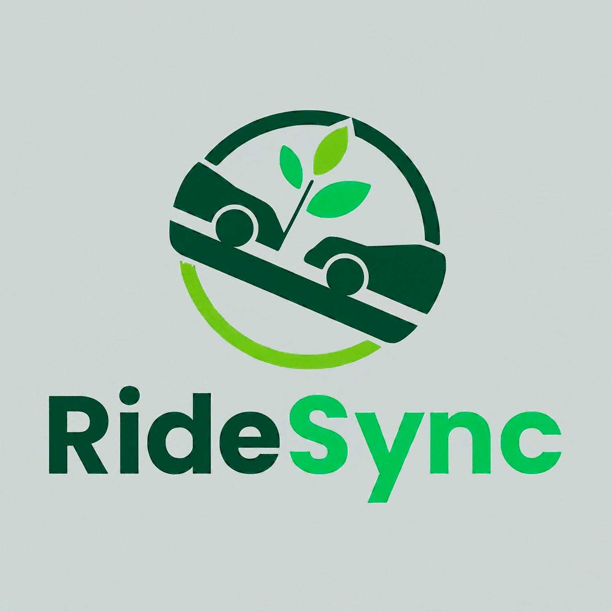
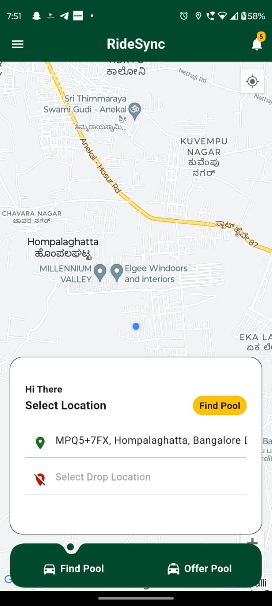
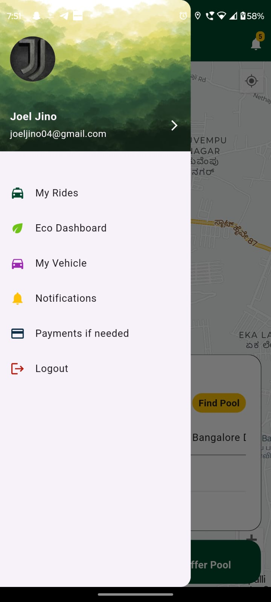
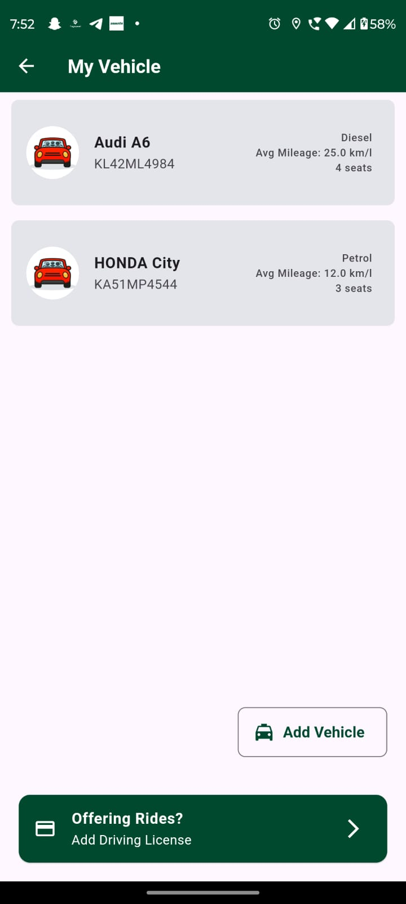
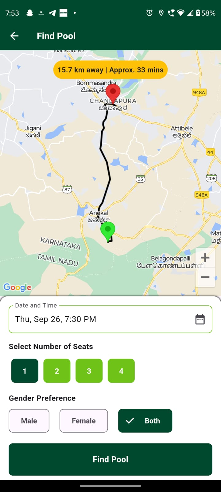
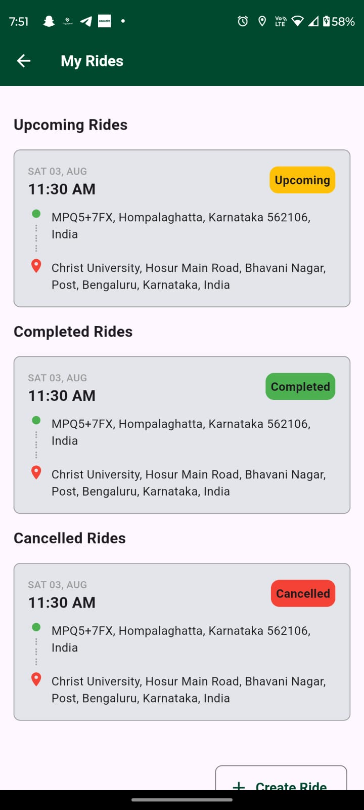
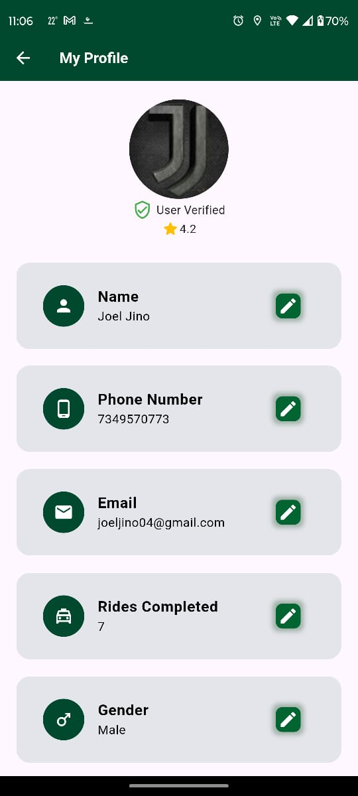
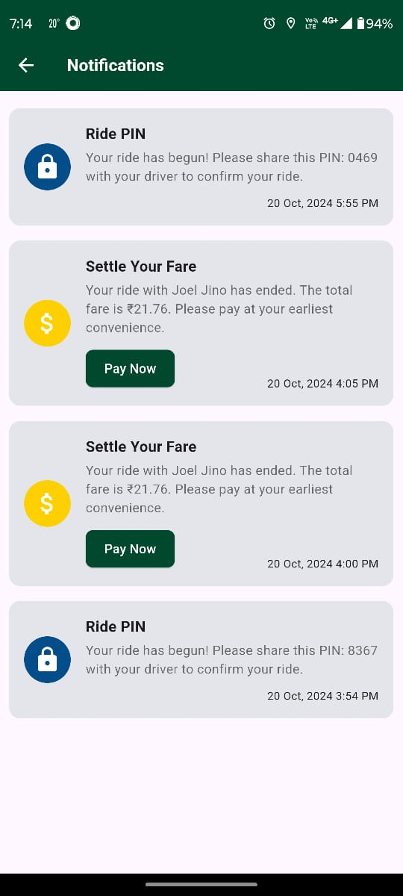
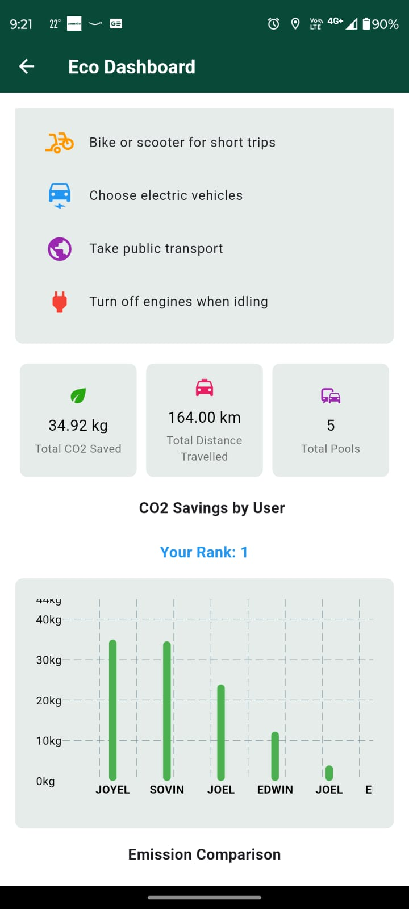
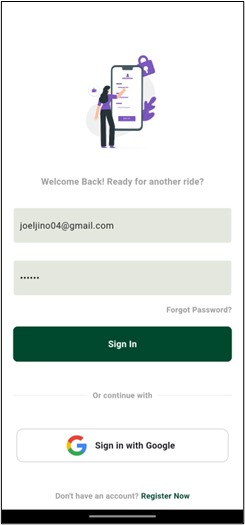

# RideSync - A Comprehensive Carpooling Solution

**RideSync** is a carpooling mobile application developed using **Flutter**, designed to streamline urban commuting by matching riders and drivers traveling along similar routes. This eco-friendly application optimizes trips, enables cost-sharing, and enhances security for a reliable carpooling experience.

    

---

## 🚀 Project Demo
*Watch the [project demo](link_to_demo_video) to see RideSync in action!*

---

## 🌟 Features

- **5 km Radius Ride Matching**: Matches ride requesters and offerers within a 5 km radius using a custom ride-matching algorithm for optimal route efficiency.
- **Eco-Dashboard**: Displays CO2 emissions prevented, promoting eco-conscious commuting.
- **Secure Onboarding**: Aadhaar-based gender verification with image text recognition for added security.
- **Cost Sharing & Notifications**: Transparent cost-sharing for fuel, along with real-time weather notifications.
- **Seamless Navigation**: Integrated with **Google Maps API** for live route and direction updates.
- **User Rating System**: Allows riders and drivers to rate each other, fostering a safe and trustworthy community.

---

## 🛠️ Technologies Used

- **Frontend**: Flutter
- **Backend**: Firebase Firestore
- **APIs**: Google Maps API, Image Text Recognition for Aadhaar verification

---

## 🖥️ Screenshots

### Home Page

    

### Drawers Page

    

### Vehicles

    

### Find Pool

    

### Rides

    

### Profile

    

### Notifications

    

### Eco Dashboard

    

### Login

    

---

## ⚙️ Getting Started

### Prerequisites

- **Flutter SDK** (Version X.X.X)
- **Firebase Account**: Set up Firebase Firestore and obtain API keys
- **Google Maps API Key**

### Installation

1. **Clone the repository**:
   
bash
   git clone [https://github.com/joel6124/RideSync_car_pooling_application.git](https://github.com/joel6124/RideSync_car_pooling_application.git)
   cd RideSync
   

2. **Install dependencies**:
   
bash
   flutter pub get

3. **Set up Firebase**:
   - Configure Firebase for the project and replace the google-services.json file in your Flutter project.
   - Enable Firestore and Cloud Functions in the Firebase Console.

4. **Configure Google Maps API**:
   - Obtain an API key from the Google Cloud Platform.
   - Add the API key in the AndroidManifest.xml file under android/app/src/main/.

### Running the App

bash
flutter run

---

## 🔍 Usage

1. **User Registration**: Sign up using Aadhaar-based verification for a secure carpooling experience.
2. **Request/Offer Rides**: Create ride requests or offers within a 5 km radius.
3. **Track Your Impact**: View your CO2 emission savings on the Eco-Dashboard.
4. **Navigation and Notifications**: Use real-time Google Maps navigation and receive weather alerts.
5. **Rate and Review**: Build community trust by rating fellow carpoolers.

---

## 💡 Future Enhancements

- Expand matching radius options for broader accessibility.
- Integrate a rewards system for eco-friendly commuters.
- Implement additional verification layers for added user security.

---

## 📄 License

This project is licensed under the MIT License.

---

**Thank you for visiting!** If you have any questions or suggestions, please feel free to reach out or contribute!

---
